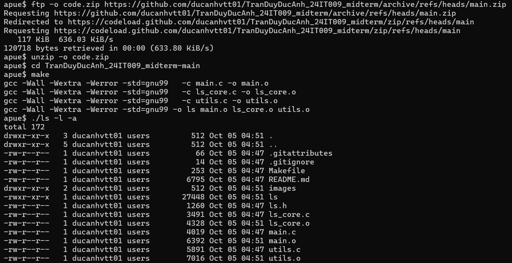

# UNIX ls(1) Implementation in C

**Student Name:** Tran Duy Duc Anh  
**Student ID:** 24IT009  
**Course:** System Programming (Lập Trình Hệ Thống) (5)  
**Supervisor** Dr. Nguyen Nhat An  
**Project:** Midterm Project – Implement ls(1)  

## Description

This project is a simplified version of the standard UNIX `ls(1)` command, written in C from scratch. It utilizes standard POSIX system calls and standard C libraries to retrieve file metadata, read directory contents, and format the output according to various flags described in the provided `ls(1)` manual page.

## Implemented Features

The program successfully implements the following options as specified in the manual page snippet:
- **-1 (NEW)**: List one entry per line (by default when output to pipe or explicitly passed)  
- **-A**: List all entries except for `.` and `..`
- **-a**: Include directory entries whose names begin with a dot (`.`)
- **-c**: Use time when file status was last changed for sorting or printing
- **-d**: Directories are listed as plain files
- **-F**: Display file type indicators (`/`, `*`, `@`, `=`, `|`)
- **-f**: Output is not sorted
- **-h**: Human readable sizes
- **-i**: Print the file serial number (inode number)
- **-k**: Sizes in kilobytes
- **-l**: List in long format (overrides -1)
- **Multi-column display**: Automatically adjusts to terminal width when standard output is a terminal (just like standard UNIX `ls`).
- **-n**: Numeric UID/GID for long format
- **-q**: Force printing of non-printable characters as `?`
- **-R**: Recursively list subdirectories
- **-r**: Reverse the sort order
- **-S**: Sort by size, largest first
- **-s**: Display the number of file system blocks
- **-t**: Sort by time modified
- **-u**: Use time of last access for sorting or printing
- **-w**: Force raw printing of non-printable characters

## 🌟 Bonus Features (Custom Extensions)
To demonstrate deeper system programming knowledge, I have implemented 3 completely new flags that do not exist in standard UNIX `ls`:
- **`-V` (Visual Tree):** Displays the directory structure recursively in a beautiful ASCII tree format (similar to the `tree` command, but integrated natively).
- **`-Y` (SummarY):** Calculates and prints a summary block at the bottom of the output, showing total files, directories, hidden files, and cumulative size.
- **`-P` (Paint/Palette):** Applies ANSI color codes to the output, dynamically highlighting directories (Blue), executables (Green), compressed archives (Red), and hidden files (Gray).
## Project Structure

- `main.c`: The entry point. Handles parsing command-line arguments using `getopt()` and coordinates the program logic.
- `ls_core.c`: Contains the core logic for iterating over directory entries and processing individual paths (including recursive logic).
- `utils.c`: Provides utility functions for parsing file modes, sorting the files (using `qsort()`), formatting human-readable output, and printing.
- `ls.h`: Header file containing structure definitions and function prototypes.
- `Makefile`: Script to automate the build process.
- `README.md`: This report file.

## Code Implementation Details (Function Explanations)

### 1. `main.c`

```c
void parse_options(int argc, char *argv[], LsOptions *options) {
    int opt;
    if (isatty(STDOUT_FILENO)) options->opt_q = true; 
    else options->opt_w = true;

    while ((opt = getopt(argc, argv, "1AacdFfhiklnqRrSstuwVYP")) != -1) {
        switch (opt) {
            case 'a': options->opt_a = true; break;
            case 'l': options->opt_l = true; options->opt_n = false; break;
            case 'V': options->opt_V = true; break;
            /* ... (other flags omitted for brevity) ... */
        }
    }
}
```
**`parse_options(...)`**: Uses the POSIX `getopt` function to parse command-line arguments. It sets the corresponding boolean flags in the `LsOptions` structure based on the flags provided by the user.

- **`main(int argc, char *argv[])`**: The main entry point. It calls `parse_options()`, separates directory operands from file operands, sorts them, and then sequentially calls `print_tree_directory()` (if `-V` is active) or `list_directory()`. Finally, it prints the global summary statistics if the `-Y` flag is set.

### 2. `ls_core.c`

```c
void process_path(const char *path, const LsOptions *options) {
    struct stat st;
    if (lstat(path, &st) == -1) {
        perror(path); exit_status = 1; return;
    }
    
    if (S_ISDIR(st.st_mode) && !options->opt_d) {
        list_directory(path, options);
    } else {
        FileInfo *fi = malloc(sizeof(FileInfo));
        /* ... (Store data and print file) ... */
        FileInfo *single_file[1] = { fi };
        print_files(single_file, 1, options);
    }
}
```
**`process_path(...)`**: Takes a path and uses `lstat()` to check if it's a directory or a file. If it's a directory (and `-d` is not set), it delegates to `list_directory()`. Otherwise, it prints the file information directly.

```c
void list_directory(const char *dir_path, const LsOptions *options) {
    DIR *dir = opendir(dir_path);
    struct dirent *entry;
    
    while ((entry = readdir(dir)) != NULL) {
        /* Filter hidden files based on -a and -A options */
        if (entry->d_name[0] == '.') {
            if (!options->opt_a && !options->opt_A) continue;
        }
        /* Read file metadata and add to array */
    }
    closedir(dir);
    
    sort_files(files, count, options);
    print_files(files, count, options);
    
    /* Recursively list subdirectories if -R is set */
    if (options->opt_R) { /* ... */ }
}
```
**`list_directory(...)`**: Uses `opendir()` and `readdir()` to iterate through all files inside a directory. It stores the file structures dynamically, calculates total allocated blocks, updates the global summary statistics (if `-Y`), sorts the entries, prints them via `print_files()`, and handles recursive directory traversal if the `-R` flag is enabled.

```c
void print_tree_directory(const char *dir_path, const char *prefix, const LsOptions *options) {
    /* ... (Directory traversal logic) ... */
    for (int i = 0; i < count; i++) {
        bool is_last = (i == count - 1);
        printf("%s%s", prefix, is_last ? "└── " : "├── ");
        /* Print colored name and recursive call */
    }
}
```
**`print_tree_directory(...)`**: A specialized recursive function to draw the directory structure in a visual ASCII tree hierarchy (`-V`). It dynamically computes the prefix format (`├──` and `└──`) for branches and passes them down into child directories.

### 3. `utils.c`
- **`make_full_path(...)`**: Utility to concatenate a directory path and a file name into a full path string.
- **`is_archive_file(...)`**: A helper function that detects `.zip`, `.tar`, `.gz`, `.rar`, and `.7z` file extensions to apply the Red color when the `-P` flag is active.
- **`compare_files(const void *a, const void *b)`**: The comparator function passed to `qsort()`. It contains the logic for sorting files lexicographically (default), by size (`-S`), or by time (`-t`, `-c`, `-u`). It also handles reverse sorting if `-r` is set.
- **`sort_files(...)`**: Wrapper around `qsort()` to sort an array of `FileInfo` structures based on user options.
- **`get_file_type_char(...)`**: Analyzes the file mode and returns the type indicator character (e.g., `d` for directory, `-` for regular file, `l` for symlink, `w` for whiteout).
- **`format_mode(...)`**: Translates the `st_mode` integer into the familiar 10-character permission string (e.g., `drwxr-xr-x`, `rws`, `rwt`).
- **`format_human_size(...)` / `print_human_readable_size(...)`**: Converts exact byte counts into human-readable formats (B, K, M, G, T) with standard rounding and unit suffix when the `-h` flag is provided.
- **`get_blocksize(...)`**: Reads the `BLOCKSIZE` environment variable or defaults to 512 bytes for block calculation.
- **`print_file_name(...)`**: Safely prints the file name. It handles appending type indicators for the `-F` flag and escaping non-printable characters for the `-q` flag.
- **`print_files(...)` / `print_files_columnar(...)`**: The core output coordination function. It dynamically detects terminal width via `ioctl()` to print clean, multi-column listings when connected to a terminal, or line-by-line format when redirected or when `-1` or `-l` is active.
- **`print_file_info(...)`**: Prints long listing entries (`-l`), including device major/minor numbers, links, permissions, owner, group, sizes, timestamps (`%b %e %H:%M`), and symlink targets.

## How to Compile and Run (on NetBSD VM)

**Step 1: Download the source code from GitHub**
Open the NetBSD terminal and run the following command to download the source code zip file:
```bash
ftp -o code.zip https://github.com/ducanhvtt01/TranDuyDucAnh_24IT009_midterm/archive/refs/heads/main.zip
```

**Step 2: Unzip and navigate to the project directory**
Unzip the downloaded file (overwriting any existing files if necessary) and change into the directory:
```bash
unzip -o code.zip
cd TranDuyDucAnh_24IT009_midterm-main
```

**Step 3: Compile the project**
Compile the project using the provided Makefile:
```bash
make
```

**Step 4: Run the program**
Run the program with any combination of supported flags. For example:
```bash
./ls -l -a
./ls -R -h
./ls -l -S -r /path/to/directory
```

**Testing the Bonus Features:**
```bash
# Test Visual Tree and Coloring together
./ls -V -P

# Test Summary Statistics and Coloring together
./ls -l -Y -P

# Test all 3 bonus features at the same time
./ls -V -Y -P
```

**After running the command successfully:**


   
**Step 5: Clean up the compiled binaries (Optional)**
```bash
make clean
```

## GitHub Repository

**Repository Link:** [https://github.com/ducanhvtt01/TranDuyDucAnh_24IT009_midterm]

